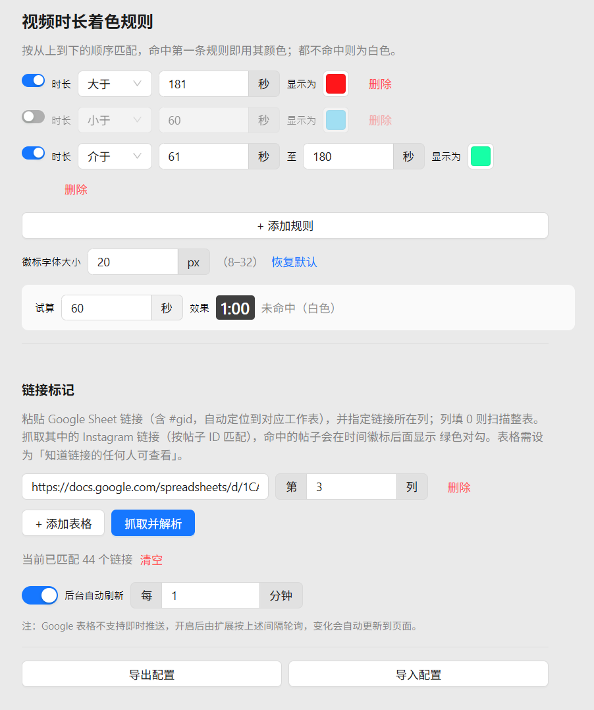
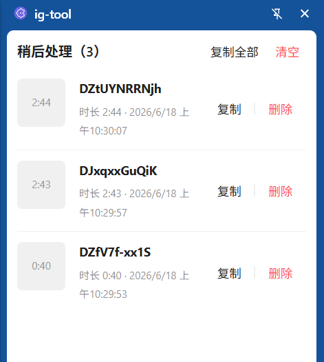

# ig-tool

一个增强 Instagram 视频浏览的 Chrome 扩展：

- **时长徽标**：在视频左上角显示时长，并可在设置页按时长规则（小于 / 大于 / 等于 / 范围）自定义徽标颜色，保存时检测规则的时长冲突。
- **链接标记**：从 Google 表格导入链接（可指定列、按 gid 定位工作表、定时自动刷新），命中的帖子在时间后显示绿色对勾。
- **稍后处理**：浏览时把视频加入收藏，在侧边栏统一查看、复制链接、删除。

# 功能展示

| 首页                                 | 视频时长徽标                               |
| ------------------------------------ | ------------------------------------------ |
|  |  |

| 设置页（着色规则）                      | 稍后处理（侧边栏）                         |
| --------------------------------------- | ------------------------------------------ |
|  |  |

# usage

```shell
$ pnpm install
$ pnpm run serve
```

# build

```shell
$ pnpm run build
```

# 如何发布新版本

本项目使用 GitHub Actions 自动构建和发布（`.github/workflows/release.yml`）。

### 发布步骤

1. 确保代码已提交并推送到 `main`：

   ```shell
   git add .
   git commit -m "改动说明"
   git push origin main
   ```

2. 更新 `package.json` 的 `version`，再创建对应的版本 tag：

   ```shell
   git tag -a v0.0.1 -m "Release v0.0.1"
   ```

3. 推送 tag 触发自动构建：

   ```shell
   git push origin v0.0.1
   ```

   GitHub Actions 会自动：构建项目 → 打包为 `ig-tool-<tag>.zip` → 生成构建溯源签名（attestation）→ 创建 Release 并上传产物。

### 版本号约定

| 版本号 | 场景     | 示例   |
| ------ | -------- | ------ |
| vX.0.0 | 重大更新 | v2.0.0 |
| vX.Y.0 | 新增功能 | v1.1.0 |
| vX.Y.Z | 修复 bug | v1.0.1 |

### 构建失败时

到仓库 Actions 页查看日志，修复后删除并重建 tag：

```shell
git tag -d v0.0.1
git push origin :refs/tags/v0.0.1
git tag -a v0.0.1 -m "Release v0.0.1"
git push origin v0.0.1
```
